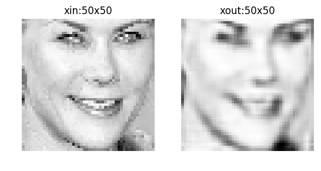
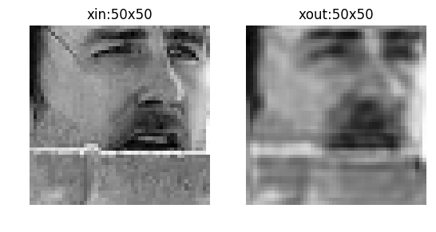
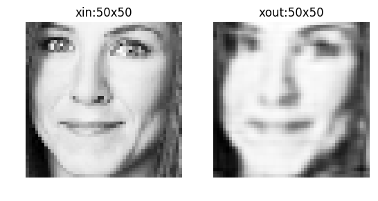
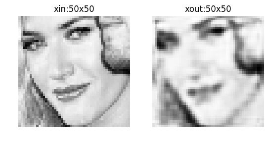
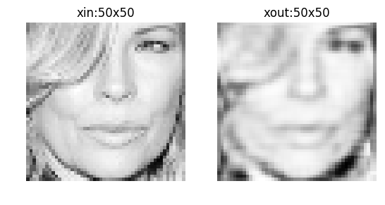
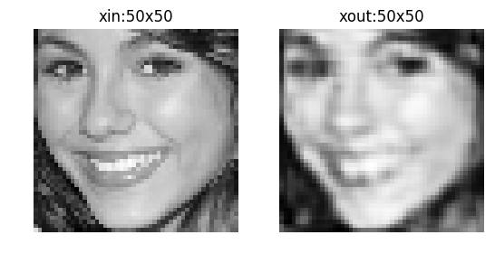

# Multi-task Learning for Structured Output Prediction
This repository contains the code used for the paper: 

`Multi-task Learning for Structured Output Prediction`, S.Belharbi, R.Hérault, C.Chatelain, S.Adam. [ArXiv](https://arxiv.org/abs/1504.07550).
## New:
> Implementation of deep convolutional auto-encoder using transposed convolution "deconvolution". Check the reconstructed images of LFPW in here:   [deep-conv-ae-lfpw-reconstruction-image](https://github.com/sbelharbi/structured-output-ae/tree/master/inout/deep-conv-ae-lfpw-reconstruction-image).

> Examples of reconstructed images (LFPW test set): images size 50x50

>  

> 

> 

Please cite this paper if you use the code in this repository as part of a
published research project.

This code is a Theano based implementation (Python 2.7). To run it, you must 
install Theano and its dependencies (numpy, matplotlib, ...). Octave and oct2py
are needed for the evaluation.

Before running the code, you need to download the data by running the script
sop_embed/download_face_data.sh.

To run the experiments mentioned in the paper, see the files in the folder:
sop_embed/experiments/*.py.

