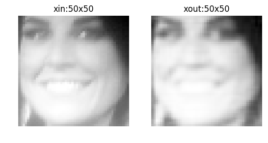
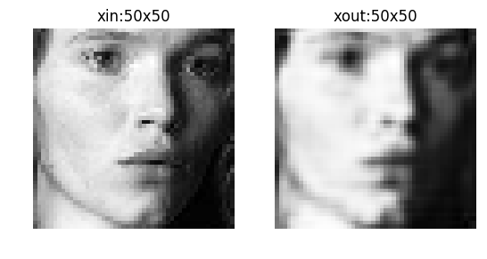
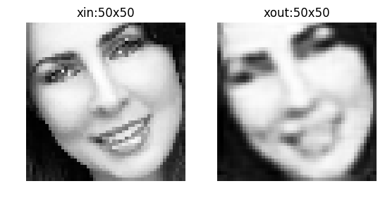
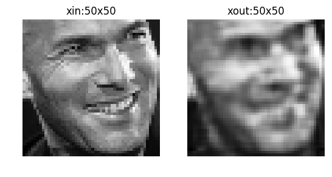

The file `reconstruction-deep-conv-ae.tar.gz` contains the image and its reconstruction for LFPW dataset using a deep convolutional autoencoder.
Here some examples of reconstructed images (LFPW test set): images size 50x50








Please check the code in the file: [`debug_deep_conv_autoenc.py`](https://github.com/sbelharbi/structured-output-ae/blob/master/sop_embed/experiments/debug_deep_conv_autoenc.py). This is the architecture we used (not optimized):
```python
# Deep conv.ae

# configure encoder
encode_cae_l0 = {"type": "conv",
                 "rng": rnd,
                 "filter_shape": (16, 3, 3),
                 "activation": "relu",
                 "padding": (1, 1),
                 "W": None,
                 "b": None,
                 "b_v": 0.,
                 "stride": (1, 1)}
encode_cae_l1 = {"type": "downsample",
                 "poolsize": (2, 2),
                 "ignore_border": False,
                 "mode": "max"}
# Dim: 16 * 25x25.
encode_cae_l2 = {"type": "conv",
                 "rng": rnd,
                 "filter_shape": (8, 3, 3),
                 "activation": "relu",
                 "padding": (1, 1),
                 "W": None,
                 "b": None,
                 "b_v": 0.,
                 "stride": (1, 1)}
encode_cae_l3 = {"type": "downsample",
                 "poolsize": (2, 2),
                 "ignore_border": True,
                 "mode": "max"}
# Dim: 8 * 12x12.

encoder_config = [encode_cae_l0, encode_cae_l1, encode_cae_l2, encode_cae_l3]

# configure decoder
decode_cae_l0 = {"type": "conv",
                 "rng": rnd,
                 "filter_shape": (8, 3, 3),
                 "activation": "relu",
                 "padding": (1, 1),
                 "W": None,
                 "b": None,
                 "b_v": 0.,
                 "stride": (1, 1)}
decode_cae_l1 = {"type": "upsample",
                 "ratio": 2,
                 "use_1D_kernel": False}
# Dim: 8 * 24x24
decode_cae_l2 = {"type": "conv",
                 "rng": rnd,
                 "filter_shape": (16, 3, 3),
                 "activation": "relu",
                 "padding": (1, 1),
                 "W": None,
                 "b": None,
                 "b_v": 0.,
                 "stride": (1, 1)}
decode_cae_l3 = {"type": "upsample",
                 "ratio": 2,
                 "use_1D_kernel": False}
# Dim: 16 * 48x48
decode_cae_l4 = {"type": "conv",
                 "rng": rnd,
                 "filter_shape": (1, 3, 3),
                 "activation": "sigmoid",
                 "padding": (2, 2),
                 "W": None,
                 "b": None,
                 "b_v": 0.,
                 "stride": (1, 1)}
# Dim: 1 * 50x50
decoder_config = [decode_cae_l0, decode_cae_l1, decode_cae_l2, decode_cae_l3,
                  decode_cae_l4]
```